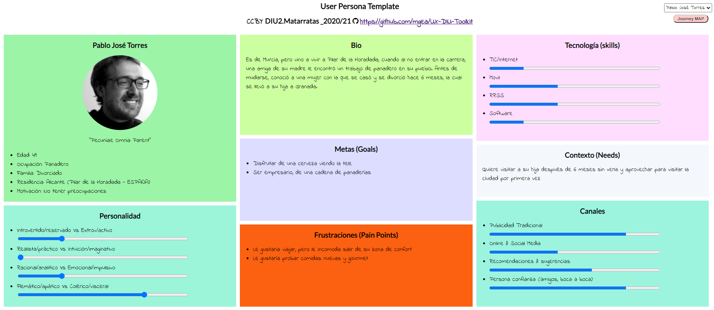
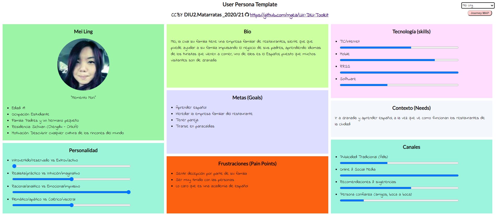
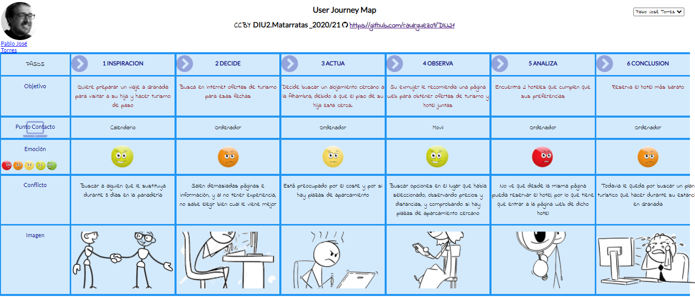
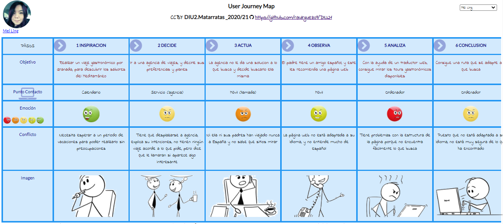

## DIU - Practica1, entregables

Alumnos: Raúl Rodríguez Pérez y Raúl Castro Moreno

Grupo: DIU2_MATARRATAS

Github: https://github.com/raulrguez09/DIU21/tree/master/P1

- Desk research: Análisis Competencia 

	Para realizar el análisis de competencia, hemos buscados unas plataformas similares que se ajusten a lo que buscamos:

	- [granadatur](http://www.granadatur.com/): Se trata de la web que hemos elegido en cuestión. Es una plataforma con un diseño bastante anticuado y con poca variedad de idiomas. Aun así, la web cuenta con bastante información sobre diversas actividades turísticas y hospedajes en Granada.
	- [turgranada](https://www.turgranada.es/): Esta plataforma posee una muy buena estructuración de la información, además el diseño de la web es intuitivo y bastante atractivo. Todo eso junto con la cantidad de idiomas que posee, presenta una muy buena opción tanto para extranjeros como para españoles.
	- [granada_info](https://granadainfo.com/): Esta web presenta un diseño minimalista pero eficaz. Presenta una gran variedad de informacion sobre la gastronomia en granada, aunque no posee ni app para móvil ni redes sociales.
	- [guias_granada](https://www.guiasgranada.com/): Esta plataforma tiene una sobrecarga en el diseño, los colores son demasiado llamativos y la informacion esta mal estructurada. Aun asi esta cuenta con app y redes sociales para promocionar su web.

	Tabla comparativa: [analisis](https://github.com/raulrguez09/DIU21/blob/master/P1/Competitor_Analysis.pdf) 

- 2 Personas 

	La primera persona que hemos creado es Pablo José Torres, una persona que lleva siendo panadero toda su vida en un pueblo de Alicante, que no ha viajado nunca y que tampoco maneja las redes sociales. Debido a un divorcio, su hija se va a vivir a Granada , y es por ello que cuando decide ir a verla, se decanta por realizar turismo por la ciudad y así aprovechar su estancia allí.

	

	La segunda persona que hemos creado es Mei Ling, una chica de nacionalidad China, la cual su familia tiene un negocio de restaurantes, y esta, con tal de ayudar a su familia, se plantea descubrir nuevos sabores los cuales puedan usar en sus restaurantes, realizando un tour gastronómico por la ciudad de Granada.

	

- 2 User Journey Map  ( 1 por persona)

	La visita de Pablo

	La primera historia, cuenta sobre como Pablo, que no ha viajado nunca, planea un viaje para visitar a su hija en Granada, y de paso hacer un tour por la ciudad, y todas las dificultades que se encuentra para poder reservar alojamiento y encontrar servicios de visitas turísticas.

	

	La ambición de Mei

	La segunda historia, cuenta como Mei desde China, planea un viaje para realizar un tour gastronómico por la ciudad de Granada en sus vacaciones, y encontrar nuevos sabores, sobre todo de la dieta Mediterránea, que pueda usar en la empresa de restaurantes de sus padres y así ayudarles con el negocio.

	
	
- Revisión de Usabilidad 
	
  - Enlace del documento: [Usability_review](https://github.com/raulrguez09/DIU21/blob/master/P1/Usability-review-GRANADATUR.pdf)

