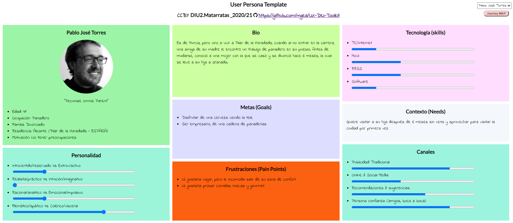

## DIU - Practica1, entregables

Alumnos: Raúl Rodríguez Pérez y Raúl Castro Moreno

Grupo: DIU2_MATARRATAS

Github: https://github.com/raulrguez09/DIU21/tree/master/P1

- Desk research: Análisis Competencia 

	Para realizar el análisis de competencia, hemos buscados unas plataformas similares que se ajusten a lo que buscamos:

	- [granadatur](http://www.granadatur.com/): Se trata de la web que hemos elegido en cuestión. Es una plataforma con un diseño bastante anticuado y con poca variedad de idiomas. Aun así, la web cuenta con bastante información sobre diversas actividades turísticas y hospedajes en Granada.
	- [turgranada](https://www.turgranada.es/): Esta plataforma posee una muy buena estructuración de la información, además el diseño de la web es intuitivo y bastante atractivo. Todo eso junto con la cantidad de idiomas que posee, presenta una muy buena opción tanto para extranjeros como para españoles.
	- [granada_info](https://granadainfo.com/): Esta web presenta un diseño minimalista pero eficaz. Presenta una gran variedad de informacion sobre la gastronomia en granada, aunque no posee ni app para móvil ni redes sociales.
	- [guias_granada](https://www.guiasgranada.com/): Esta plataforma tiene una sobrecarga en el diseño, los colores son demasiado llamativos y la informacion esta mal estructurada. Aun asi esta cuenta con app y redes sociales para promocionar su web.

	Tabla comparativa: [analisis](https://github.com/raulrguez09/DIU21/blob/master/P1/Competitor_Analysis.pdf) 

- 2 Personas 
	

- 2 User Journey Map  ( 1 por persona)
- Revisión de Usabilidad 
	

(valoración y conclusiones de esta etapa)
