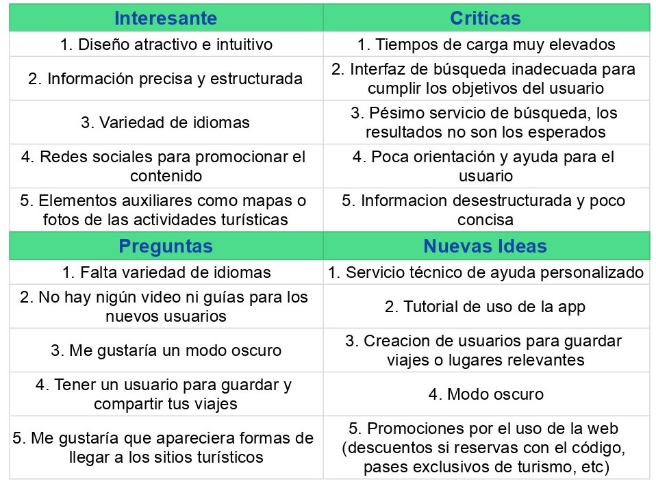

## DIU - Practica2, entregables

### Feedback Capture Grid: Malla Receptora De Información.

### PROPUESTA DE VALOR

* TourGraná

La aplicación móvil a desarrollar trata de una plataforma insitucional para realizar turismo sobre la ciudad de Granada. La plataforma pondrá en contacto a las diferentes partes: Usuarios, profesionales y establecimientos, para una mayor facilidad de organización. Los usuarios tendrán la ventaja de poder realizar turismo con ventajas si se realiza en grupos de personas, disponiendo así de un costo menor. Los profesionales licenciados en turismo, tendrán beneficio tanto económico como de experiencia. Los establecimientos reciben el beneficio de la promoción por parte de la aplicación y además se podrán ofrecer a cambio de algún beneficio sus establecimientos para la realización de alguna actividad cultural.

ScopeCanvas

### TASK ANALYSIS

* User Task Matrix 

|GRUPOS DE USUARIOS                 | Usuarios        | Profesionales        | Profesional     | Establecimientos   | Usuarios no registrados  |
| :------:                          | :------:        | :------:             |  :------:       | :------:           |  :------:                |
| Registrarse e iniciar sesión      | Alto            |  Alto                |     Alto        | Alto               | NO                       |
| Consultar próximos eventos        | Medio           |  Bajo-Medio          |     Alto        | Alto               | NO                       |
| Añadir a "Mi Viaje"               | Medio-Alto      |  Medio-Alto          |     Alto        | Alto               | NO                       |
| Reservar hotel                    | Alto            |  Alto                |     Alto        | Bajo               | NO                       |
| Reservar actividad                | Medio           |  Medio               |     Alto        | Alto               | NO                       |
| Cambiar idioma                    | Bajo            |  Bajo                |     Alto        | Alto               | NO                       |
| Visitar redes sociales del app    | Alto            |  Alto                |     Alto        | Alto               | NO                       |
| Contactar con establecimiento     | Medio           |  Bajo-Medio          |     Alto        | Alto               | NO                       |
| Búsqueda avanzada                 | Medio-Alto      |  Medio-Alto          |     Alto        | Alto               | NO                       |
| Establecer promoción.             | Alto            |  Alto                |     Alto        | Alto               | NO                       |
| Consultar promociones.            | Medio           |  Medio               |     Alto        | Alto               | NO                       |
| Hacer uso de ayuda en tiempo real | Bajo            |  Bajo                |     Alto        | Alto               | NO                       |
| Aportar comentarios               | Bajo            |  Bajo                |     Alto        | Alto               | NO                       |
| Consultar chat.                   | Alto            |  Alto                |     Alto        | Alto               | NO                       |
| Alta o baja en grupo              | Medio           |  Medio               |     Alto        | Alto               | NO                       |
| Consultar establecimiento         | Bajo            |  Bajo                |     Alto        | Alto               | NO                       |
| Activar Modo Oscuro               | Bajo            |  Bajo                |     Alto        | Alto               | NO                       |

* User/Task flow

### ARQUITECTURA DE INFORMACIÓN

* Sitemap 
* Labelling 

### Prototipo Lo-FI Wireframe 

### Conclusiones  
(incluye valoración de esta etapa)
