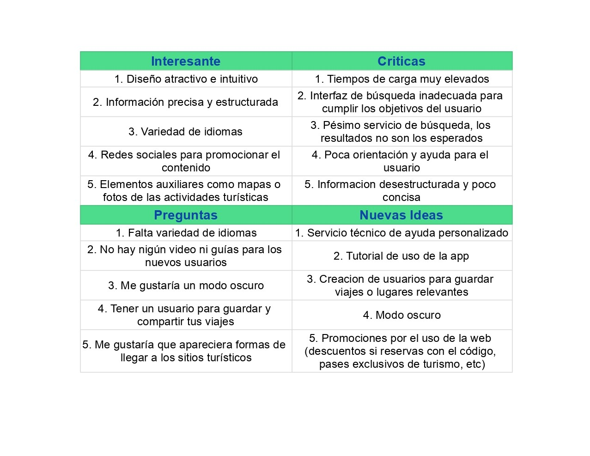

## DIU - Practica2, entregables

### Feedback Capture Grid: Malla Receptora De Información.

### PROPUESTA DE VALOR

La aplicación móvil a desarrollar trata de una plataforma insitucional para realizar turismo sobre la ciudad de Granada. La plataforma pondrá en contacto a las diferentes partes: Usuarios, profesionales y establecimientos, para una mayor facilidad de organización. Los usuarios tendrán la ventaja de poder realizar turismo con ventajas si se realiza en grupos de personas, disponiendo así de un costo menor. Los profesionales licenciados en turismo, tendrán beneficio tanto económico como de experiencia. Los establecimientos reciben el beneficio de la promoción por parte de la aplicación y además se podrán ofrecer a cambio de algún beneficio sus establecimientos para la realización de alguna actividad cultural.

ScopeCanvas

### TASK ANALYSIS

* User Task Matrix 

|GRUPOS DE USUARIOS              | Usuario         | Usuario Premium      | Profesional     | Establecimientos   | Usuarios no registrados  | Ranking  |
| :------:                       | :------:        | :------:             |  :------:       | :------:           |  :------:                | :------: |
| Buscar.                        | Alto            |  Alto                |     Alto        | Alto               | NO                       | 12       |
| Abonar Dinero.                 | Medio           |  Bajo-Medio          |     Alto        | Alto               | NO                       | 10.5     |
| Consultar Correo.              | Medio-Alto      |  Medio-Alto          |     Alto        | Alto               | NO                       | 10       |
| Consultar chat.                | Alto            |  Alto                |     Alto        | Bajo               | NO                       | 10       |
| Consultar Promociones.         | Medio           |  Medio               |     Alto        | Alto               | NO                       | 10       |
| PUES buenos dias               | Bajo            |  Bajo                |     Alto        | Alto               | NO                       | 8        |

* User/Task flow

### ARQUITECTURA DE INFORMACIÓN

* Sitemap 
* Labelling 

### Prototipo Lo-FI Wireframe 

### Conclusiones  
(incluye valoración de esta etapa)
