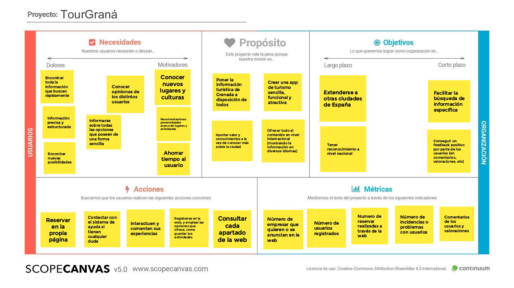
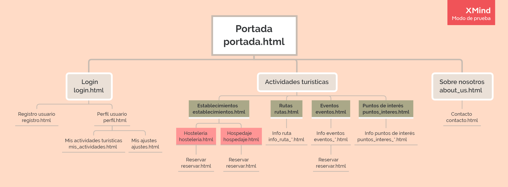

## DIU - Practica2, entregables

### Feedback Capture Grid: Malla Receptora De Información.

### PROPUESTA DE VALOR

* TourGraná

La aplicación móvil a desarrollar trata de una plataforma insitucional para realizar turismo sobre la ciudad de Granada. La plataforma pondrá en contacto a las diferentes partes: Usuarios, profesionales y establecimientos, para una mayor facilidad de organización. Los usuarios tendrán la ventaja de poder realizar turismo con ventajas si se realiza en grupos de personas, disponiendo así de un costo menor. Los profesionales licenciados en turismo, tendrán beneficio tanto económico como de experiencia. Los establecimientos reciben el beneficio de la promoción por parte de la aplicación y además se podrán ofrecer a cambio de algún beneficio sus establecimientos para la realización de alguna actividad cultural.

### TASK ANALYSIS

* User Task Matrix 

|GRUPOS DE USUARIOS                 | Población Local | Turismo Nacional     | Turismo Internacional  | Establecimientos   | Usuarios no registrados  |
| :------:                          | :------:        | :------:             |  :------:              | :------:           |  :------:                |
| Iniciar sesión                    | Alto            |  Alto                |     Alto               | Alto               | NO                       |
| Registrarse                       | NO              |  NO                  |     NO                 | NO                 | NO                       |
| Consultar próximos eventos        | Medio           |  Bajo                |     Medio              | Alto               | Medio                    |
| Añadir a "Mi Viaje"               | Bajo            |  Medio-Alto          |     Medio-Alto         | Bajo               | NO                       |
| Reservar hotel                    | Bajo            |  Alto                |     Alto               | Bajo               | NO                       |
| Reservar actividad                | Medio           |  Alto                |     Alto               | Bajo               | NO                       |
| Cambiar idioma                    | Bajo            |  Bajo                |     Alto               | Bajo               | Medio                    |
| Visitar redes sociales del app    | Medio           |  Alto                |     Alto               | Medio-Alto         | Alto                     |
| Contactar con establecimiento     | Medio           |  Medio-Alto          |     Alto               | Bajo               | NO                       |
| Búsqueda avanzada                 | Medio           |  Alto                |     Alto               | Alto               | NO                       |
| Establecer promoción.             | Bajo            |  Bajo                |     Bajo               | Alto               | NO                       |
| Consultar promociones.            | Alto            |  Alto                |     Alto               | Medio-Alto         | NO                       |
| Hacer uso de ayuda en tiempo real | Medio-Alto      |  Medio-Alto          |     Alto               | Alto               | Bajo                     |
| Aportar comentarios               | Medio           |  Medio               |     Medio              | Bajo               | NO                       |
| Consultar chat.                   | Bajo            |  Bajo                |     Bajo               | Medio              | NO                       |
| Alta o baja en grupo              | Bajo            |  Alto                |     Alto               | Bajo               | NO                       |
| Consultar establecimiento         | Medio           |  Alto                |     Alto               | Medio              | Medio                    |
| Activar Modo Oscuro               | Alto            |  Alto                |     Alto               | Alto               | Alto                     |
| Usar mapa para ver ubicaciones    | Medio           |  Alto                |     Alto               | Alto               | Bajo                     |

### ARQUITECTURA DE INFORMACIÓN

* Sitemap

|Label                              | Scope Note                                                                                                    |
| :------:                          | :------:                                                                                                      |
| Portada                           | Página principal de la app                                                                                    |
| Login                             | Formulario donde se añaden los datos para el inicio de sesión                                                 |
| Registro usuario                  | Formulario donde se añaden los datos para el registro de usuario                                              |
| Perfil usuario                    | Página perfil del usuario, apareciendo sus datos                                                              |
| Mis actividades turísticas        | Lista donde se guarda cualquier actividad para planificar el viaje                                            |
| Mis ajustes                       | Página que permite modificar el perfil del usuario , pudiendo poner el modo nocturno y darse de baja          |
| Actividaes turísticas             | Página donde elegir que buscas, si Establecimientos, rutas, o puntos de interés                               |
| Establecimientos                  | Página donde elegir si el establecimiento que buscas es de Hostelería o de Hospedaje                          |
| Hostelería                        | Muestra los lugares de comida más destacados de Granada                                                       |
| Hospedaje                         | Muestra los lugares de hospedaje de Granada                                                                   |
| Eventos                           | Muestra los próximos eventos reseñables que se celebren en Granada                                            |
| Puntos de interés                 | Página donde se listan los puntos de interés                                                                  | 
| Rutas                             | Página que contiene las rutas más realizadas por Granada                                                      |
| Info ruta                         | Página que ofrece información sobre una ruta concreta                                                         |
| Info Eventos                      | Página que ofrece información sobre un evento concreto                                                        | 
| Info Punto de Interés             | Página que ofrece información sobre un punto de interés concreto                                              |
| Sobre nosotros                    | Muestra información de la página y su organización                                                            |
| Contacto                          | Contiene la información de contacto de la organización                                                        | 
| Reservar                          | Página que permite reservar cualquier cosa seleccionada, sea un evento, hospedaje o hostelería                |

* Labelling

|Label                              | Scope Note                                                    | Icon   |      
| :------:                          | :------:                                                      | :-----:|
| Pagina principal                  | Permite volver a la pagina principal                          |        |
| Perfil de usuario                 | Nos dirige al perfil del usuario                              |        |
| Mostrar contraseña                | Muestra la contraseña                                         |        |
| Imagen usuario                    | Muestra la imagen del usuario                                 |        |
| Login                             | Sirve para inciar sesión                                      |        |
| Registrar                         | Sirve para registrar a un nuevo usuario                       |        |
| Redes sociales                    | Muestra los iconos de redes sociales                          |        |
| Botón de contacto                 | Botón para contactar con nosotros                             |        |
| Barra de búsqueda                 | Permite realizar búsquedas                                    |        |
| Filtro de busqueda                | Permite filtrar las búsquedas                                 |        |
| Imagen actividad                  | Imagen de una actividad                                       |        |
| Sección de ayuda                  | Mostrar opciones de ayuda al usuario                          |        |
| Valoración sitio                  | Muestra estrellas (0 a 5) para medir el grado de satisfacción |        |
| Comentarios                       | Comentarios de los usuarios                                   |        |
| Galería de imágenes               | Galeria de imagenes sobre actividades                         |        |
| Ubicación                         | Mapa de una ubicación                                         |        |
| Enlace a maps                     | Enlace a google maps sobre una ubicación concreta             |        |

### Prototipo Lo-FI Wireframe 

### Conclusiones  
(incluye valoración de esta etapa)
