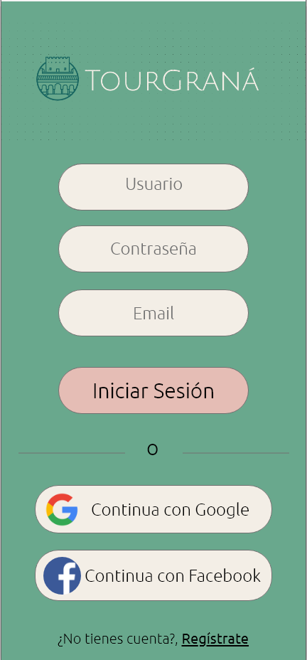
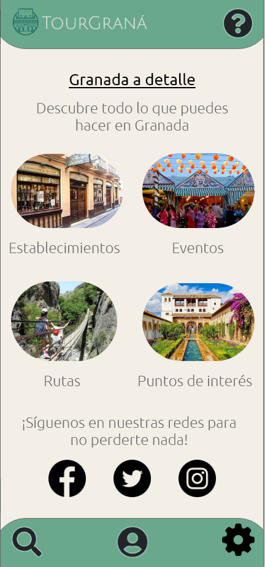
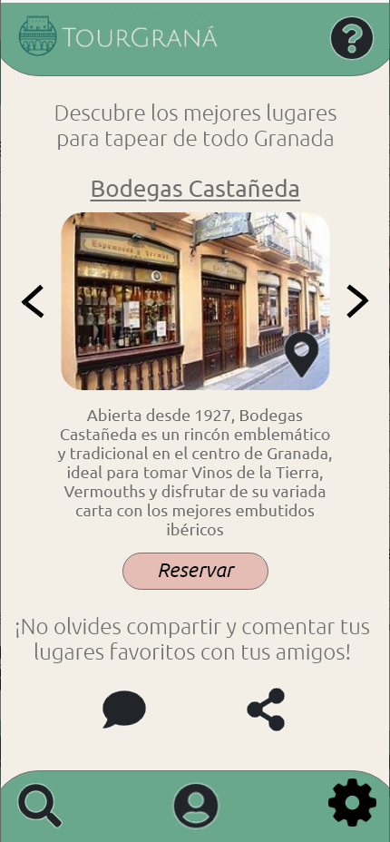
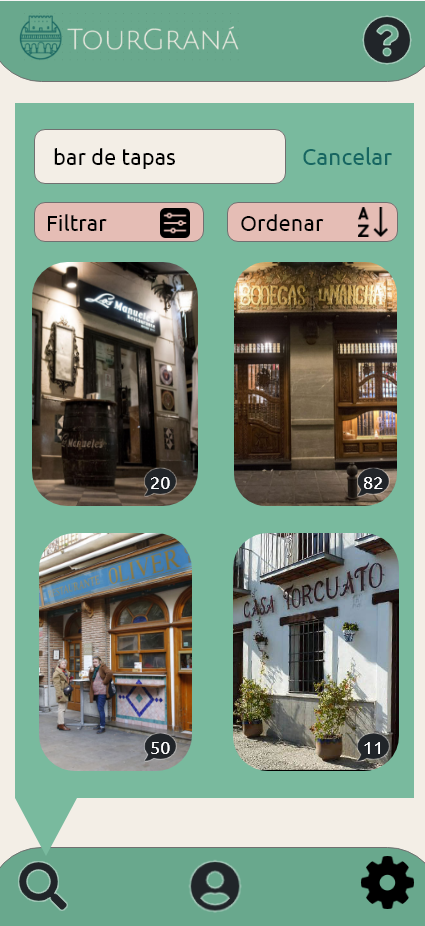
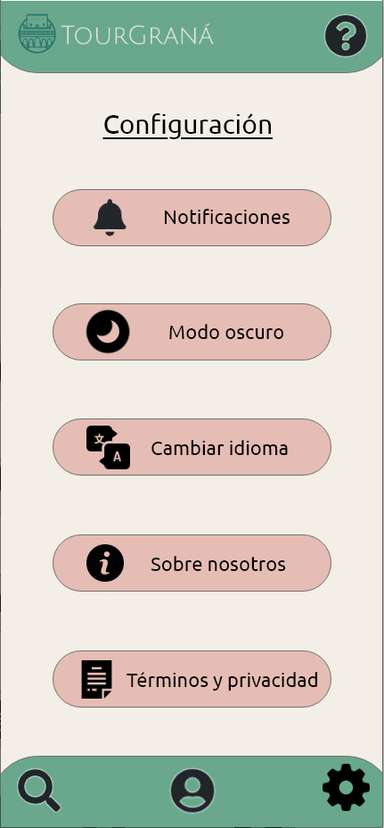

# DIU - Practica 3, entregables

Como parte de la elaboración de la práctica 3, debemos crear nuestro propio diseño visual identificable. Para ello hemos elegido realizar un Moodboard o muro de inspiración, para ayudarnos a conseguir diferentes ideas para nuestro proyecto.

## Moodboard (diseño visual + logotipo)   

En el Moodboard se incluyen los principales elementos de diseño a considerar antes de comenzar con el bocetaje HI-FI de la aplicación, es decir, los guidelines. Estos son una serie de elementos que nos van a permitir establecer un conjunto de reglas de utilidad general para la creación del diseño final. Nosotros hemos reunido diferentes aspectos como pueden ser nuestro logotipo, una paleta de colores, nuevos iconos, las fuentes utilizadas, y tres imágenes inspiradoras con un boceto de la apariencia visual deseada.

* Paleta de colores

Hemos utilizado una paleta de colores con diversos tonos verdosos, que hacen recordar a los coloridos jardines de la principal atracción turística de Granada, la Alahambra. Además, poseemos colores pastel con un tono más claro que los verdes, para emplear en las letras y permitirnos destacar su contenido con respecto al fondo, aportando al mismo tiempo una atracción visual agradable para el usuario.

* Tipografía

Para la tipografía hemos utilizado la misma fuente en todo el texto de nuestro diseño, dicha fuente tiene por nombre 'Ubuntu', y se visualiza así:

   

Esta es una fuente clara, moderna y perfectamente legible, que compagina muy bien con nuestros deseos para el diseño. Es decir, conseguir una letra que incentive a su lectura y no dificulte su comprensión. Aún así, hemos querido diferenciar entre los títulos y el texto normal, poniendo un formato 'regular 400' para los títulos, aportando mas grosor y tamaño a la letra. Con esto conseguimos llamar la atención en un primer momento a los lectores.

Y por otro lado, en el resto del texto, se empleará un formato 'Light 300', un estilo con menos grosor, pero igual de legible y sencilla, para no cansar al lector.

* Logotipo

Partiendo de los colores seleccionados, se ha creado un logotipo sencillo pero efectista, que consigue transmitir una imagen moderna y actual. Este logotipo se ha creado usando la herramienta para crear logos que posee 'Wix'. Además, gracias a esta herramienta hemos podido realizar el siguiente apartado que son las 'Imágenes inspiradoras'.

* Imágenes inspiradoras 

Como hemos comentado, haciendo uso de las herramientas que ofrece 'Wix', hemos realizado 3 imágenes inspiradoras a modo de bocetos, o primera versión, sobre el posible diseño que tendria nuestra proyecto.

* Iconos

En este caso, se han reemplazado algunos de los iconos incluidos en el bocetaje inicial, por otros con un diseño más adecuado al estilo de la aplicación.

## Landing Page
A continuacion hemos creado nuestra landing page o pagina de aterrizaje/principal, diseñada para conseguir la atracción del público objetivo, el cual en este caso, consta de usuarios que quieran conocer las actividades turísticas de granada. Para ello hemos utilizado un título y subtítulo motivadores y llamativos, una imagen atrayente y un CTA incitador.

## Patrones UI

Para realizar los layouts finales de la aplicación, hemos buscado antes unos patrones de diseño que aplicar y tener como guía para crearlos. Para saber que patrones usar hemos utilizado de apoyo la web de [Mobbin](https://mobbin.design/patterns).

- Incorporación: Para el acceso a la aplicación, empleamos los patrones de diseño de inicio de sesión y registro, dando posibilidad de realizarlo con la cuenta de Google o Facebook.
 
- Contenido: Aqui tenemos el patron de diseño de la configuración, donde cambiar idioma y el modo oscuro, tambien el patrón de mapas y un patron para realizar la página principal, con una galería de imágenes.

- Datos: Aquí, vamos a aplicar un patrón de búsqueda, y además , el patrón de filtros y ordenación, que se apliquen a los resultados obtenidos en las búsquedas. 

- Comunicación: En este caso aplicaremos 3 patrones de diseño, el de "nosotros" que de información de la aplicación, otro de ayuda, en caso de no saber que hacer, y por último, el de privacidad y términos legales. 

- Social: Aplicaremos un patrones de comentarios, de compartir por redes sociales, y el de disponer de un perfil de usuario.

- Layout: Finalmente , en layout aplicaremos un patron de modo oscuro, el cuál estará activado por defecto, pero se podrá cambiar.

## Mockup: LAYOUT HI-FI
* Inicio de sesión

* Homepage

* Establecimientos

* Busqueda

* Configuración

## Documentación: Publicación del Case Study

Para la documentación de la realización de la práctica, hemos decidido hacer un vídeo de unos 3 min, explicando y argumentando el como ha sido el desarrollo y las cosas que hemos realizado para poder completarla.

Puedes ver el vídeo en el siguiente link(Solo con cuenta de la UGR): https://drive.google.com/file/d/12OhtLHe4xZZKN48ny_6Uap1PHJHwGE0P/view?usp=sharing
 
